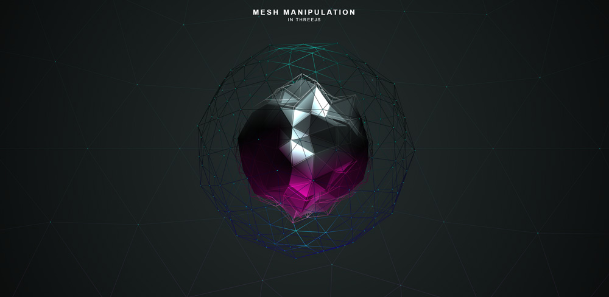

# Webcam Texturing in ThreeJS

This is the repository for my ThreeJS experiment. This experiment uses _getUserMedia();_ to pull webcam data and apply that data to multiple WebGL objects in ThreeJS.

**__The live project needs an SSL certificate to access your webcam. However, until I purchase an SSL cert, you will receive a non-secure warning with viewing the live project. Please continue to the project and ignore the warning. Nothing will happen :)__**

### Note
This project uses a web standard which is in the process of being deprecated. A new web standard will eventually replace it, but for the time being, I will continue updating this project using the old standard until all clients support the new standard.

This project also uses Gulp and Gulp Server for live reloads on the local server (http://localhost:8000)
